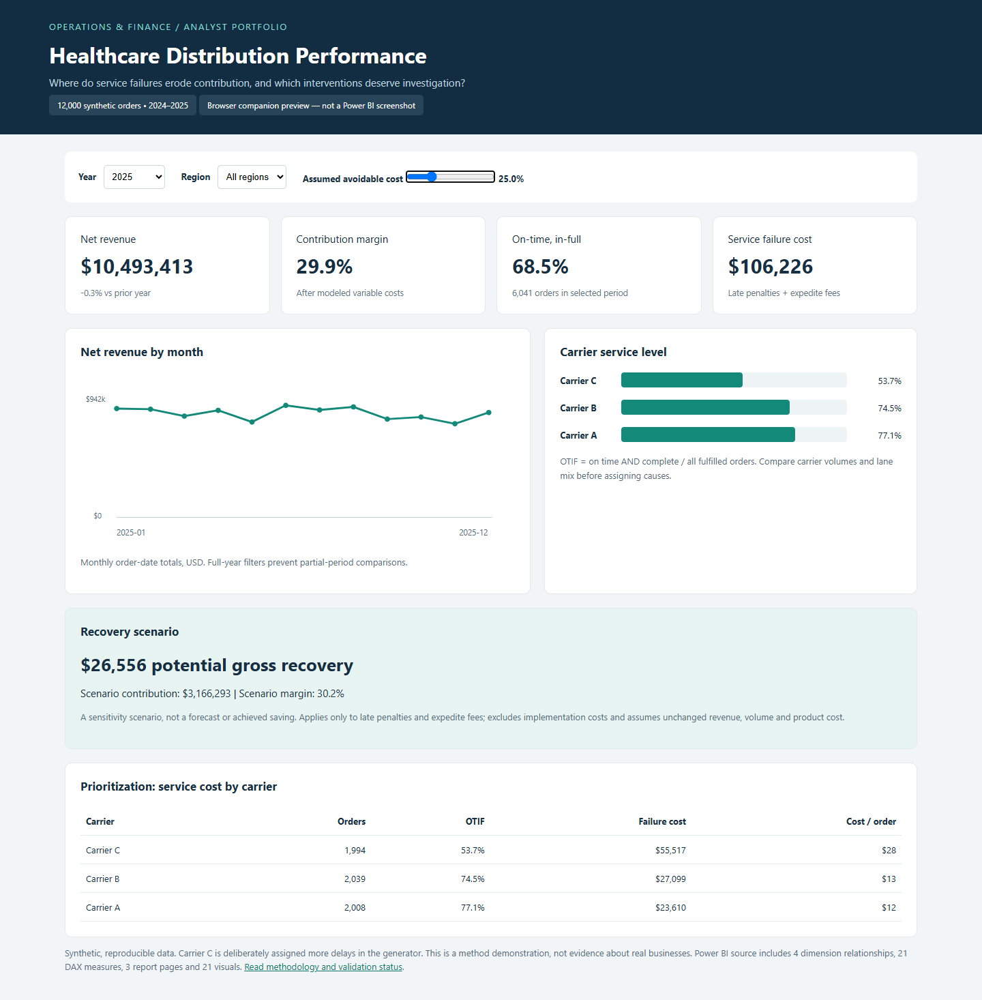
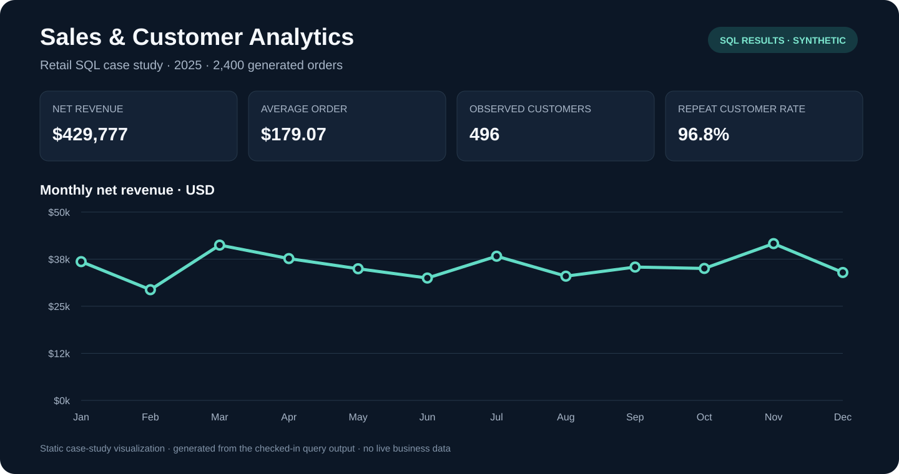

# Data Analyst Portfolio

Three reproducible analytics case studies using Power BI, SQL and Python. All data is synthetic. No employer data, credentials or resume contact details are included.

## Featured: Healthcare Distribution Power BI

[Open the flagship project](healthcare-distribution-powerbi/README.md) · [Power BI project file](healthcare-distribution-powerbi/Healthcare.pbip) · [DAX measures](healthcare-distribution-powerbi/measures.dax)

12,000 orders, a star schema, 21 DAX measures and three report pages connecting service failures to contribution margin. Includes Power Query import partitions, a disconnected recovery scenario, SQL reconciliation and an interactive HTML companion.



**Validation:** Data/SQL checks and 28 PBIR schema checks passed. Power BI Desktop refresh, DAX engine execution and native visual QA are pending because Desktop was unavailable in the authoring environment. Review the project README for the exact verification steps.

## Other projects

| Project | Business question | Tools |
|---|---|---|
| [Retail performance](retail-performance/README.md) | How do revenue and contribution vary by month and region? | SQL, Python, SQLite |
| [Distribution SLA](distribution-sla/README.md) | Which carriers have lower on-time and complete-delivery rates? | SQL, Python, SQLite |

### Retail performance preview



### Distribution SLA preview


## Run

Requires Python 3.10 or newer; no third-party packages needed.

```sh
python analyze.py
python healthcare-distribution-powerbi/build.py
python scripts/build_previews.py
```

Open `index.html` in a browser to view the summary dashboard. Review `FINDINGS.md` for conclusions and limitations. Each project contains source CSV data, executable SQL and exported query results. SQLite runs in memory; the seeded generator recreates all inputs.

## Business questions

1. **Retail:** How do revenue, contribution and order value change by month and region? What share of customers placed multiple orders during the observation year?
2. **Distribution:** Which carriers have lower on-time and on-time-in-full (OTIF) rates? How does OTIF change monthly?

## Data dictionary

Retail grain: one order. `order_id` is unique; `order_date` is ISO date; region/category are dimensions; customer_id identifies a synthetic customer; units is quantity; gross_sales, discount, refunds and cost are USD order amounts. Refunds represent full post-discount order refunds. Costs remain incurred on refunded orders.

Distribution grain: one shipment. shipment_id is unique; month is YYYY-MM; carrier/region are dimensions; promised_days and actual_days are transit durations; complete is a 0/1 indicator. The two tables are separate demonstrations and should not be joined just because their IDs match.

## KPI definitions

- Net revenue: gross sales minus discounts and refunds.
- Contribution: net revenue minus modeled product cost; excludes operating expenses.
- Average order value: net revenue divided by all orders, including refunded orders.
- Repeat-customer rate: customers with more than one order / observed customers. This is not cohort retention.
- On-time rate: shipments arriving within the promised duration / all shipments.
- OTIF: shipments both on time and complete / all shipments.
- Average delay: nonnegative late days averaged across all shipments, including on-time shipments as zero.

## Quality and interpretation

The build asserts input counts, unique order IDs, refund bounds, transit validity, completion flags, and independent Python/SQL reconciliations. Synthetic distributions are simplified and intentionally create carrier differences. No causal inference, actual savings or real business impact is claimed.

## Interview walkthrough

Explain the grain, numerator and denominator of each KPI. Run the SQL and reconcile totals. Discuss why refunds affect contribution, why repeat purchase differs from retention, and why carrier comparisons need lane/service controls. Change a generator assumption and rebuild to understand its effect before presenting this portfolio as your own work.
