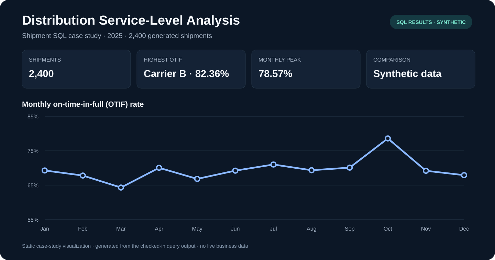

# Distribution Service-Level Analysis



This case study compares carrier on-time and on-time-in-full (OTIF) performance across generated shipments. All records are synthetic; the deliberately different carrier distributions demonstrate analysis methods rather than real-world carrier performance.

## Preview

The chart above is rendered from [`results/analysis_2.csv`](results/analysis_2.csv), produced by the SQL in [`analysis.sql`](analysis.sql). It is a static case study graphic, not a live dashboard.

## KPI definitions

- On-time: actual transit days are less than or equal to promised days.
- OTIF: a shipment is both on time and complete, divided by all shipments.
- Average delay: late days averaged across every shipment, with on-time shipments contributing zero.

## Reproduce

From the portfolio root:

```sh
python analyze.py
python scripts/build_previews.py
```

The input at [`data/synthetic_data.csv`](data/synthetic_data.csv) contains 2,400 generated shipments. Compare carriers only after considering lanes, distance, service class, and shipment mix.

