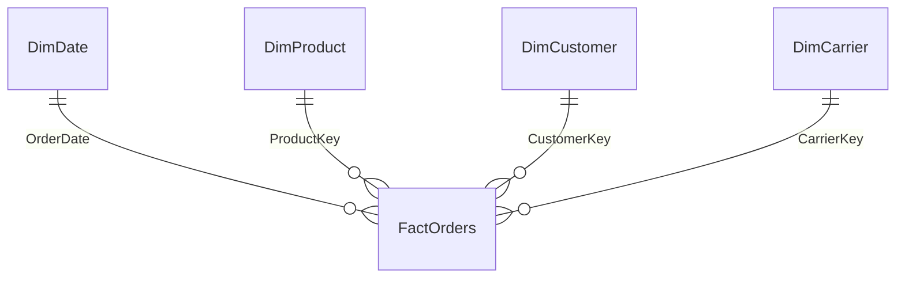

# Healthcare Distribution: Service Cost & Margin Analytics

**Flagship Power BI project | Power Query, DAX, star schema, SQL, Python**

**Status:** Report and semantic-model source authored; data integrity and SQL reconciliations executed. Power BI Desktop is unavailable in the authoring environment, so Desktop open/refresh, DAX engine results and native visual rendering still require verification. The HTML companion is independently implemented and is not proof of Power BI execution.


## Business decision

A fictional healthcare distributor wants to identify where late deliveries reduce contribution and estimate the gross opportunity from avoiding a portion of service-failure costs. The analysis brings financial and operational KPIs together so a manager can prioritize investigation rather than merely view charts.

## Deliverables

- `Healthcare.pbip`: editable Power BI project, with a PBIR report and `model.bim` semantic model.
- Three pages: executive overview, service diagnostics and recovery scenario.
- 21 DAX measures, 4 single-direction dimension relationships and a disconnected recovery assumption table.
- 12,000 generated fulfilled orders covering 2024–2025, 48 facilities, 4 product categories and 3 carriers.
- `preview.html`: interactive browser companion with year/region filters and a recovery slider.
- `validation.sql`, exported result tables and `results/validation.json`.

## Open in Power BI Desktop

1. Download or clone the entire repository. Keep both Healthcare folders next to `Healthcare.pbip`.
2. Use a current Power BI Desktop release supporting PBIP/PBIR. If prompted, enable the corresponding project/report preview features and restart Desktop.
3. Open `Healthcare.pbip` and select Refresh. Partitions embed compressed CSV data, so no database account, personal path or network data source is required.
4. Verify the four many-to-one relationships and the date table. `DimDate[Date]` is unique and continuous, with Time category and key metadata; mark it as the date table in Desktop if needed.
5. With all slicers cleared, reconcile the cards with `results/query_1.csv`. Select 2025 for a complete prior-year comparison.
6. Test every page, year/region slicer and chart selection. On the scenario page, choose one recovery rate. The DAX measure defaults to 25% for no selection or multiple selections.
7. Set recovery to 0% and 100% and check the endpoints. Run `desktop_checks.dax` in DAX Query View to compare engine results against SQL. Save a `.pbix` copy and export genuine screenshots after verification.

Microsoft references: [project report structure](https://learn.microsoft.com/en-us/power-bi/developer/projects/projects-report), [semantic model structure](https://learn.microsoft.com/en-us/power-bi/developer/projects/projects-dataset).

## Rebuild

```sh
python build.py
```

Uses only Python's standard library. Seed 2609 fixes the inputs. `build.py` regenerates CSVs, the model, the report, SQL results and browser preview. DAX is available separately in `measures.dax` and in `model.bim`. Rebuilding overwrites generated files; retain manual Power BI edits on a separate branch or update the generator first.

## Model and grain



FactOrders contains one fulfilled order with one shipment; counts therefore represent orders and shipments equally. Recovery is deliberately disconnected. Filters flow from dimensions to the fact; there are no bidirectional or many-to-many joins.

### Data dictionary

| Table | Grain and columns |
|---|---|
| DimDate | One day; Date, Year, YearMonth; 731 days including leap day |
| DimProduct | One category; ProductKey, Category, Storage |
| DimCustomer | One synthetic facility; CustomerKey, Facility, Region, Segment |
| DimCarrier | One fictional carrier; CarrierKey, Carrier |
| Recovery | One selectable rate, 0%–100% in 5-point steps |
| FactOrders | OrderKey, OrderDate, three dimension keys, Units; USD GrossSales, Discount, Refund, COGS, Freight, Penalty, Expedite; binary OnTime/InFull and integer DelayDays |

## Metric contract

- Net revenue = gross sales − discounts − refunds.
- Contribution = net revenue − product cost − base freight − late penalties − expedite fees. This is **not net profit**; overhead and tax are excluded.
- Refunds reverse post-discount revenue. Product cost remains incurred; no inventory recovery is assumed.
- Service-failure cost = penalties + expedite fees. It excludes refunds and does not double-count base freight.
- OTIF = orders that are both on time and complete / all fulfilled orders. Cancelled/unfulfilled orders are outside this dataset.
- Average late days excludes on-time orders; it is different from average delay across all orders.
- Prior-year measures require comparable periods. The model has no 2023 data; use 2025 vs 2024. YTD is calendar year to date.
- Potential recovery = selected avoidable share × service-failure cost. It is a sensitivity assumption, not a predicted or realized saving. Subtract intervention cost before estimating net benefit.

## Interpretation and next action

Carrier C's elevated delay probability is deliberately built into the generator. No claims about a real carrier or healthcare outcomes follow from these results. Validate lane, distance, storage, service class and customer mix with real data before attributing carrier performance. A useful next step would be a controlled operational pilot with an agreed baseline, implementation costs and service metrics.

## Validation and interview defense

The build checks key uniqueness, foreign-key coverage, a continuous date range, refund bounds, on-time flags, monthly-to-total revenue, Python/SQL financial reconciliation, OTIF reconciliation and hand-calculated edge cases. These do not substitute for executing DAX in Power BI.

Be ready to explain: why the grain matters; why OTIF uses an AND; why contribution differs from profit; why a disconnected parameter changes a scenario without filtering orders; why Power Query assigns currency/date types; and why an apparent carrier effect is not causal evidence.

This project was developed with AI assistance. Review the code, reproduce it, verify it in Desktop and make your own design decisions before presenting it in an interview.
